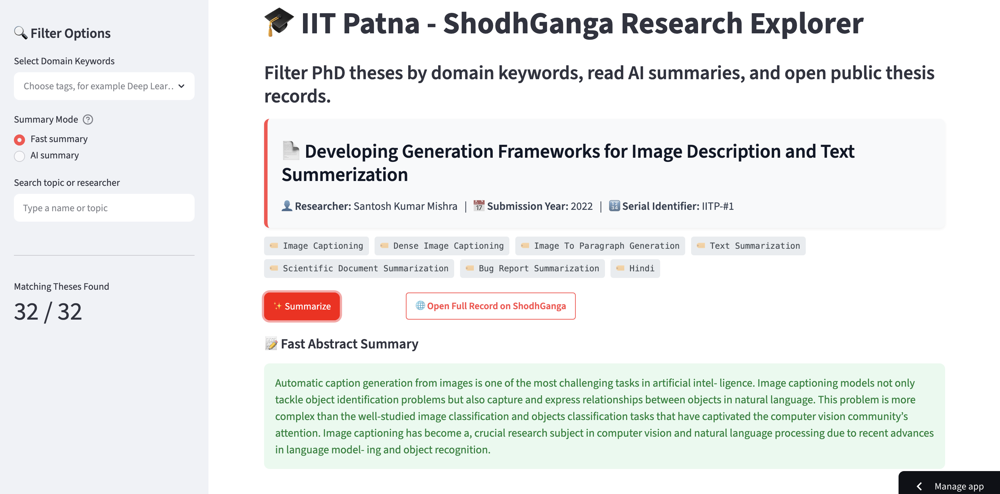

# 🎓 IIT Patna - ShodhGanga Research Explorer

  
  &nbsp;
  
  &nbsp;
  

An end-to-end data engineering and text mining system that centralizes, normalizes, and dynamically indexes PhD thesis abstracts from the **Indian Institute of Technology Patna (IIT Patna)** Computer Science department repository. The application integrates an optimized open-source distilled Transformer pipeline running fully locally, allowing researchers and recruiters to explore domain keywords and synthesize complex academic contexts into immediate executive summaries on demand.

---

## 📸 Application Dashboard Preview

### 🔍 Interactive Keyword Filters & Analytics Panel
The sidebar interface dynamically parses the multi-tag keywords array from the master dataset, standardizes character text casings, and updates matching research entries in real-time.

  

---

## 🛠️ Key Pipeline & Application Features

* **Advanced Data Normalization Engine:** Cleans layout carriage artifacts (`\n`), normalizes researcher names, resolves cell data-type mismatches, and patches missing keyword vectors with precise domain categories.
* **Granular Multi-Select Filtering Loop:** Provides an instant search experience across the entire 32-thesis catalog by cross-matching intersecting research keywords.
* **Zero-Cost Edge Inference Runtime:** Loaded through a custom cached Hugging Face pipeline that executes seamlessly on standard machine CPU tiers with zero external token configurations.
* **Polished Portfolio Styling UI:** Features custom-designed container cards with responsive visual padding, structural tags, and clean native action buttons.

---

## 📁 Repository Structure

📁 iitp-research-explorer/
│
├── 📄 shodhganga_final_clean.csv    # Standardized 32-row master dataset asset (0 missing cells)
├── 📄 app.py                        # Streamlit web application source dashboard script
├── 📄 requirements.txt              # Production dependency packages configuration file
├── 📄 .gitignore                    # Local environment and cache exclusion directives
├── 📄 dashboard.png                 # App interface preview screenshot asset
├── 📄 summary.png                   # AI text summary preview screenshot asset
└── 📄 README.md                     # Project portfolio presentation documentation

---

## ✍🏻 Author
Rohit Patil
---
